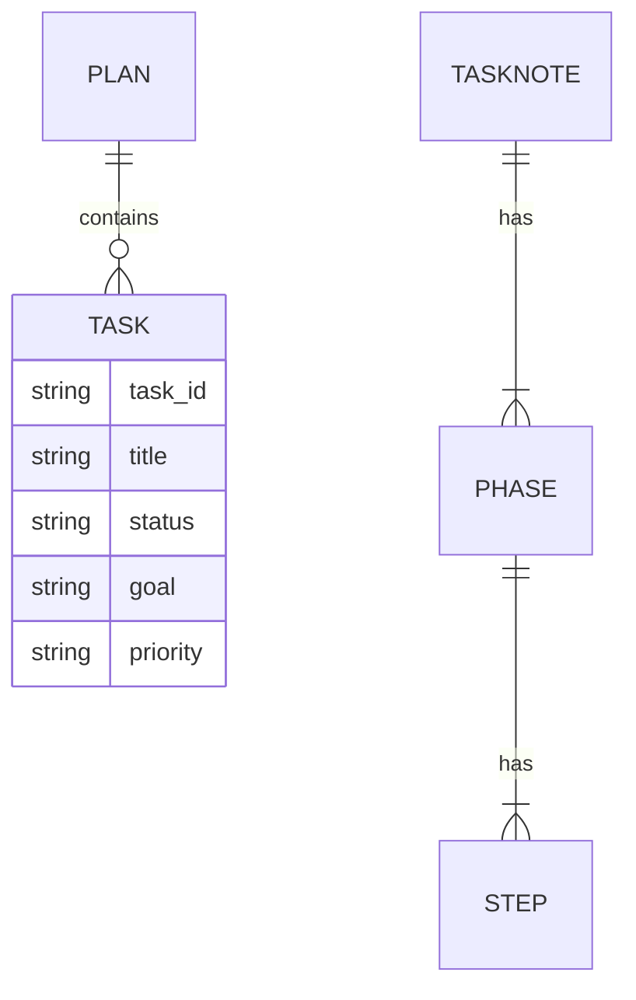

### Flowtron (Single-file, Project-agnostic TaskNote Guide)

Flowtron is a lightweight, reusable workflow for planning and executing tasks with AI assistance. This single README is the complete, project-agnostic reference for creating and driving TaskNotes without relying on project-specific rules.

### What this provides

- Reusable TaskNote workflow (four phases) with a mandatory Relevance gate
- Minimal JSON shapes you can copy into any repo (no templates required)
- Optional Cursor usage notes for consistent agent behavior

### Core workflow (four phases)

1. Task Discovery

- Review the related plan entry and context
- Research optimal approach for the current codebase and constraints
- Task Relevance Assessment (MANDATORY): confirm the task is still needed and not superseded; record decision: Proceed / Re-scope / De-scope
- Clarifications: ask targeted questions only if needed; otherwise log “No clarifications needed” and assumptions
- Discover relevant files and current state; adapt implementation approach
- Starting commit when ready

2. Task Execution

- Implement the minimal, optimal solution
- Create/update tests
- Run targeted tests frequently

3. Testing and Linting

- Run appropriate test suites for the changed areas
- Fix issues; verify coverage/quality targets (if applicable)
- Perform quick visual/manual checks if relevant

4. Task Closure

- Verify all steps across all phases are completed
- Update any inventories/docs relevant to the change
- Archive/close the TaskNote; update plan status

### Minimal JSON shapes (copy as needed)

TaskNote (concise example):

```json
{
  "$schema": "http://json-schema.org/draft-07/schema#",
  "schema_version": "1.0.0",
  "task_id": "TN-001",
  "title": "Short title",
  "goal": "Brief goal",
  "priority": "Medium",
  "file_inventory": [],
  "phases": [
    {
      "phase_id": 1,
      "name": "Task Discovery",
      "description": "Research, relevance, clarity",
      "completion_check": {
        "status": "Pending",
        "incomplete_steps": [1, 2, 3, 4, 5, 6, 7]
      },
      "steps": [
        {
          "step_id": 1,
          "description": "Review related plan entry",
          "status": "Pending",
          "progress": []
        },
        {
          "step_id": 2,
          "description": "Research optimal approach for current context",
          "status": "Pending",
          "progress": []
        },
        {
          "step_id": 3,
          "description": "Relevance Assessment: Proceed/Re-scope/De-scope with rationale",
          "status": "Pending",
          "progress": []
        },
        {
          "step_id": 4,
          "description": "Clarifications or 'No clarifications needed' + assumptions",
          "status": "Pending",
          "progress": []
        },
        {
          "step_id": 5,
          "description": "Discover files and current state",
          "status": "Pending",
          "progress": []
        },
        {
          "step_id": 6,
          "description": "Adapt approach based on discoveries",
          "status": "Pending",
          "progress": []
        },
        {
          "step_id": 7,
          "description": "Starting commit",
          "status": "Pending",
          "progress": []
        }
      ]
    }
  ],
  "metadata": {
    "tags": [],
    "area": "",
    "difficulty": "Medium",
    "estimated_impact": "Medium"
  },
  "summary": null,
  "guidance_notes": [
    "Use Relevance Assessment as a hard gate",
    "Ask clarifications only when needed; otherwise log assumptions",
    "Keep progress logs concise and high-signal"
  ]
}
```

Plan (concise example):

```json
{
  "$schema": "http://json-schema.org/draft-07/schema#",
  "schema_version": "1.0.0",
  "plan_id": "REPLACE_WITH_PLAN_ID",
  "last_updated": "REPLACE_WITH_ISO8601",
  "vision": "Short description",
  "next_priority": "TN-001",
  "tasks": [
    {
      "task_id": "TN-001",
      "title": "Short task title",
      "status": "Not Started",
      "goal": "Single-sentence goal",
      "priority": "Medium",
      "steps": ["Concise, high-signal steps"],
      "dependencies": []
    }
  ],
  "guidance_notes": [
    "Prioritize by priority, then lowest TN-###",
    "Keep steps succinct; avoid redundancy with TaskNotes"
  ]
}
```

### Optional Cursor usage notes (project-agnostic)

- Name chats clearly: "Plan | <Brief>", "T### | Task Name", "Debug | <Brief>", etc.
- Provide 1–2 sentence status updates before running tools; don’t proceed to Execution with blocking ambiguity
- Parallelize read-only searches; sequence only when outputs are required for next steps
- After edits, run only the tests relevant to the changed areas; ensure a green run before closure
- At closure, present a short completion summary and ask for confirmation to mark complete

### Storage and evolution

- JSON-first with `schema_version: "1.0.0"`
- Future discovery may evaluate YAML or a database (e.g., PostgreSQL) for scalability and querying
- Track schema changes via a simple changelog in your repo if needed

### Visualization (separate repo)

- Suggested stack: Vite + React + TypeScript + Tailwind + Zustand + React Router
- MVP: load local JSON, display phases/status/priority (Kanban), detail panel, search/filter

### Priority system and task selection (generic)

- Priority levels: Critical > High > Medium > Low > Backlog
- Selection rule: pick by priority first, then by lowest incomplete `task_id`
- Numbering: sequential for ad hoc tasks (e.g., BE-008 → BE-009); decimals only for epic subtasks (e.g., BE-015.1)

This mirrors the streamlined system used in FinTown (see that project’s history docs), expressed here in project-agnostic form.

### Plan structure (generic baseline)

- Plans may be split per functional area (e.g., `plan-backend.json`, `plan-frontend.json`), with a coordinating main plan if desired
- Recommended file naming: `plan-<area>.json`; tasks use `<AREA>-###` (e.g., BE-001, FE-001)
- Keep tasks actionable with clear goals, steps, optional acceptance criteria, and dependencies

Project-specific plans can extend this baseline with additional fields as needed.

### Files in this folder

- `README.md` — this single-file, project-agnostic TaskNote guide
- `prompt-template.md` — concise starter prompt for Flowtron-guided sessions
- `plan-flowtron.json` — implementation roadmap with TN-### tasks
- `templates/plan-template.json` — base plan template (TN-###)
- `templates/plan-sub-template.json` — category-scoped plan template (e.g., backend, frontend, database, testing)
- `templates/tasknote-template.json` — TaskNote template with four phases and Relevance gate

How to use these:

- Start a session with `prompt-template.md` (copy/paste into your assistant)
- Create or update a plan using `templates/plan-template.json` (or `plan-sub-template.json` for category-specific plans)
- For implementation work, create a TaskNote from `templates/tasknote-template.json` and follow the phases in this README

### Schema & migration notes (v1)

- schema_version: "1.0.0"
- Required fields (Plan): `$schema`, `schema_version`, `plan_id`, `last_updated`, `tasks[] { task_id, title, status, goal, priority }`
- Optional fields (Plan): `estimated_time`, `next_priority`, `steps`, `dependencies`, `acceptance_criteria`, `guidance_notes`
- Required fields (TaskNote): `$schema`, `schema_version`, `task_id`, `title`, `goal`, `priority`, `phases[]`, `file_inventory`
- Optional fields (TaskNote): `metadata`, `summary`, `guidance_notes`
- Change policy: additive-first; breaking changes require a new schema_version and a short migration note here

### Storage evaluation (summary)

- JSON (current): ubiquitous, simple diffs, easy for tools/AI; strict syntax helps validation
- YAML: more human-friendly but looser; optional future support if needed for CI/Actions
- PostgreSQL: strong querying, multi-user edits, and history; adds infra and migration overhead
- Recommendation: keep JSON for MVP; evaluate YAML/DB after UI MVP; document any transition plan here
- Phased plan:
  - Phase 1 (MVP): JSON-only (current templates), schema_version enforced
  - Phase 2 (Evaluate): Prototype YAML parsing and JSON↔YAML conversion; validate AI/tooling ergonomics
  - Phase 3 (Design): Draft DB schema for plans/tasknotes; outline migrations/versioning and CLI/API impacts
  - Phase 4 (Decision): Choose path based on UI usage, contributors’ needs, and tooling; schedule migrations if needed

### Compatibility (FinTown → Flowtron)

- Plans: FinTown `_project/plan-*.json` map to Flowtron plan fields (`task_id`, `title`, `status`, `goal`, `priority`, `steps`, `dependencies`)
- TaskNotes: FinTown phases/steps map 1:1; Flowtron adds `schema_version` and `guidance_notes`
- Do not modify FinTown files; if adapters are needed, list them as backlog and keep mappings here

### Diagrams (Mermaid)

```mermaid
flowchart TD
  A[Plan (TN-###)] --> B[Task Discovery]
  B --> C[Task Execution]
  C --> D[Testing & Linting]
  D --> E[Task Closure]
  B -->|Relevance Gate| G{Proceed?}
  G -->|Proceed| C
  G -->|Re-scope| B
  G -->|De-scope| E
```


