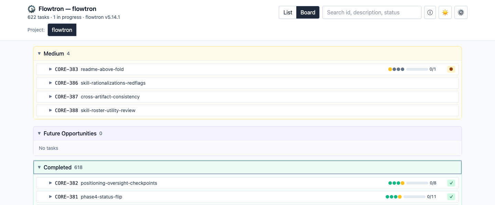

# flowtron

<p align="center">
  
</p>

<p align="center">
  <a href="LICENSE"></a>
  <a href="https://github.com/fakeneuron/flowtron/releases"></a>
  <a href="https://github.com/fakeneuron/flowtron/actions/workflows/ci.yml"></a>
</p>

A lightweight, project-agnostic tasknote system for solo AI-assisted coding.
One source of truth, consumed by adopting projects via git submodule.

The goal: catch the agent before it wastes a session. The four phases, the
relevance gate, and the acceptance criteria are the checkpoints where you
look — and one task per context window keeps each one small enough to
actually review. No scripts, daemons, databases, or schemas to maintain.



Flowtron is built with flowtron: **824 tasks** closed through this exact
workflow between 2026-04-28 and 2026-08-30 (as of 2026-08-30) — each one with
a tasknote preserved in [`.flowtron/tasknote/archive/`](.flowtron/tasknote/archive/).
Count and date range are recomputed each release by `/ft-release` §7.1's
"Standing README task-counter check" (one archived tasknote per closed task,
standalone or epic child) — see `claude/skills/ft-release/SKILL.md`.

## Quickstart

**Once per machine** — clone flowtron anywhere and wire the bootstrap skill:

```sh
git clone https://github.com/fakeneuron/flowtron.git ~/code/flowtron
ln -s ~/code/flowtron/claude/skills/ft-new-project      ~/.claude/skills/ft-new-project
ln -s ~/code/flowtron/claude/commands/ft-new-project.md ~/.claude/commands/ft-new-project.md
```

**Once per project** — from the project root (a git repo with an `AGENTS.md`
or `CLAUDE.md`):

```sh
/ft-new-project
```

That adds the flowtron submodule, wires the adopter skill subset — the tasknote
family, the two worktree utilities, and `/ft-update`, whose exact roster is the
`ln -s` block in [`claude/AGENTS-snippet.md`](claude/AGENTS-snippet.md)
§"One-time symlink wiring" — and drops in the `.flowtron/` skeleton in one
pass. Then file a task in `.flowtron/PLAN.md` and run it:

```sh
/ft-task CORE-001
```

Prefer to wire it by hand, or not using Claude Code?
[docs/MIGRATION.md](docs/MIGRATION.md) carries the manual path (§1.1–1.7), the
full one-time global-install table (§1.0), and Codex / Cursor / Grok wiring (§1.2).
Grok is Cursor-shaped — it scans `.claude/skills/`, `.agents/skills/`, and
`.cursor/skills/`, so existing Claude, Codex, or Cursor wiring already
serves it; Grok-only projects follow [`grok/AGENTS-snippet.md`](grok/AGENTS-snippet.md).

<details>
<summary><b>All documentation</b></summary>

- [SPEC.md](SPEC.md) — canonical workflow contract (4-phase tasknote
  lifecycle, relevance gate, post-closure protocol, versioning rules)
- [docs/PHILOSOPHY.md](docs/PHILOSOPHY.md) — the "why": drift across prior
  per-project workflows and the principles that stuck
- [docs/VISION.md](docs/VISION.md) — outward-facing identity: who flowtron
  is for, the principles (recap of SPEC), and the PR/suggestion archetypes
  flowtron deliberately rejects
- [docs/GLOSSARY.md](docs/GLOSSARY.md) — alphabetized one-line definitions for
  ~68 load-bearing terms, phases, markers, and grammar elements (lazy-loaded
  pointer to SPEC anchors)
- [docs/MIGRATION.md](docs/MIGRATION.md) — adoption guide for fresh projects
  and migration from a prior workflow system
- [docs/CONVENTIONS.md](docs/CONVENTIONS.md) — conventions flowtron adheres to
  (Conventional Commits, SemVer, GFM, Diátaxis, GitHub Actions CI) and
  declines (CHANGELOG, ADR registry, release automation, pre-commit hooks, MCP
  servers, package-manager / marketplace distribution, template override
  stacking) with rationale
- [docs/VERSION-HISTORY.md](docs/VERSION-HISTORY.md) — curated, moderately-coarse
  release highlights (not a CHANGELOG); full notes live in annotated tags
- [docs/AGENT-NEUTRALITY.md](docs/AGENT-NEUTRALITY.md) — agent-neutrality
  contract: which contract-layer Claude-specific surfaces are intentional
  (load-bearing locators for the Claude Code wiring layer) and why
- [docs/PLATFORMS.md](docs/PLATFORMS.md) — multi-platform wiring pattern:
  the two-layer model (agent-neutral contract / per-platform wiring) and
  the symmetric plug-in shape by which platforms plug in (Claude Code and
  Codex CLI full wiring; Cursor and Grok thin siblings (Grok is
  Cursor-shaped: `.claude/skills/` / `.agents/skills/` / `.cursor/skills/`
  compat plus Grok-only `.grok/skills/`); others conversational)
- [docs/AGENT-COMPAT.md](docs/AGENT-COMPAT.md) — living agent-compatibility
  matrix: which AI coding agents flowtron supports, their contract
  entry-points, skill primitives, and last-verified currency
- [docs/DOGFOOD.md](docs/DOGFOOD.md) — pasteable verification procedure any AI
  agent runs to confirm flowtron compatibility and refresh its
  `docs/AGENT-COMPAT.md` `last-verified` row
- [docs/WORKTREES.md](docs/WORKTREES.md) — worktree convention for parallel
  epic children: the five locked decisions (location, branch naming, skill
  pair, tasknote handling, cleanup) behind `/ft-worktree-start` +
  `/ft-worktree-end`
- [docs/EXTERNAL-AGENTS.md](docs/EXTERNAL-AGENTS.md) — handing a single
  tasknote off to an external CLI agent (Kiro / Claude Code / Codex): the
  one-agent-per-tasknote rule, the handoff contract, worktree isolation for
  parallel runs, and the orchestration contract a caller running tasknotes
  with nobody watching reports to — convention and contract only, no
  orchestration runtime
- [CONTRIBUTING.md](CONTRIBUTING.md) — solo-maintenance model, how to file
  issues, when PRs make sense
- [SECURITY.md](SECURITY.md) — threat model (prompt injection via
  user-authored markdown, submodule supply-chain trust, viz dev-server
  scope) and how to report a vulnerability

</details>

## Visualizer

`viz/` is a read-only view of every flowtron-adopting project under
your workspace — a priority-grouped list by default, with an optional
board mode. Open tasks with an active tasknote in
each project's `.flowtron/tasknote/` are flagged **In progress**. The
header-rail project selector swaps the active project;
the header subhead shows task counts, in-progress count, and the flowtron
version the selected project is using (from its `.flowtron/core/SPEC.md`).
Each project chip carries a version-currency dot — green when the project is
pinned at the latest released flowtron tag, red when it's behind, none when
no pin is readable. Filters and scroll position reset on switch.

Run **once per machine** from flowtron's own checkout — there is no
per-project install step. The dev server is pinned to port `5120` with
`strictPort`, so a second instance fails fast rather than scanning the same
workspace on a different port.

```sh
cd ~/code/flowtron/viz
npm install
npm run dev
```

The scanner globs `${FLOWTRON_VIZ_WORKSPACE:-~/code}/*/.flowtron/PLAN.md` to
discover projects; the directory name (e.g., `myproject`) becomes the project
label. Dirs without a `.flowtron/PLAN.md` are silently skipped. Set
`FLOWTRON_VIZ_WORKSPACE` if your projects live somewhere other than
`~/code/`.

Adopter projects' own `.flowtron/core/viz/` continues to work (read-only
submodule, unchanged) but is no longer the recommended path — prefer the
single global instance above.

## Working in markdown vaults

Flowtron is editor-agnostic — markdown files in git remain the source of
truth — but two of its choices happen to fit markdown-vault tools
(Obsidian, Foam, Logseq) natively:

- The `[[TASK-ID]]` cross-references in tasknote bodies are standard
  wikilink syntax (clickable links + surfaced in graph views).
- The YAML frontmatter on every tasknote (`status`, `tags`, `due`,
  `related-tasks`) is the shape vault-tool query plugins consume.

**Obsidian.** Open the project root (or just `.flowtron/`) as a vault and
tasknotes become a queryable, graph-viewable knowledge base with no extra
wiring. A minimal
[Dataview](https://blacksmithgu.github.io/obsidian-dataview/) snippet
(Obsidian-only) to list open tasks:

````markdown
```dataview
TABLE status, due
FROM ".flowtron/tasknote"
WHERE status != "completed"
SORT due
```
````

**Foam.** Wikilinks (including `[[note#Section]]` and `[[note|alias]]`)
and the graph view work out of the box in VS Code. No built-in query
plugin equivalent to Dataview.

**Logseq.** Wikilinks resolve natively. Frontmatter caveat: Logseq's
preferred form is block-properties (`key:: value`), not YAML — flat
markdown-with-YAML vaults still load, but querying tasknote metadata
uses Logseq's `:query` syntax rather than Dataview.

These tools are opt-in companion surfaces. None of the above is required.

## Agent memory

Autonomous AI coding agents — Claude Code sessions, sub-agents, fresh
context windows — need persistent memory that survives the context window:
state on disk they can reload and resume from. Flowtron's markdown state
model already is that layer:

- `PLAN.md` — durable intent: priorities, open tasks, and recent
  `## Completed` history in one scannable, git-versioned file. Older closed
  rows rotate verbatim to a sibling `PLAN-ARCHIVE.md` so the active plan
  stays bounded ([SPEC/tasknote-selection.md](SPEC/tasknote-selection.md)
  §"`## Completed` rotation"); nothing is ever deleted.
- `tasknote/<ID>.md` — working state for the active task: goal,
  acceptance criteria, subtasks, and the phase log. A fresh session (or a
  sub-agent handed the task) reads one file and picks up where the last
  context window stopped — and a session ending mid-task can leave an
  optional `## 🔄 Handoff` brief ([SPEC.md](SPEC.md) §"Tasknote body
  shape") to make that read cheaper still.
- `archive/<area>/` — long-term memory: one file per completed task,
  preserving decisions, regressions, and rationale. The Phase 1 archive
  skim ([SPEC.md](SPEC.md) §"📝 Phase 1: Discovery") is the recall step —
  grep the archive for prior work on the files in scope before acting.
- Git history — provenance and time-travel for all of the above; the
  memory is diffable, revertable, and reviewable like any other source.

There is no memory database, vector store, or server here — markdown
files in git are the memory. Nothing to enable: the workflow writes this
layer as a side effect of doing the work.

## Sessions, loops, and sub-agents

"One task per context window" ([SPEC.md](SPEC.md) Core Principle #3) has
an operator-side half: the reset *between* tasks. The assistant cannot
clear its own context — the post-closure cue ("Clear your session, then
run: …") hands that step to the operator. An agent that chains tasks
autonomously in one session skips the reset and accretes context; an
*unbounded* sub-agent — one turned loose without a stated scope or a
defined thing to return — starts a fresh context outside the workflow's
gates and archive trail. Neither breaks flowtron — but both quietly drop
the discipline the sizing principle depends on. The safe patterns:

- **One tasknote per session.** A fresh session *is* the reset, and it's
  cheap: the tasknote is the resume point (§"Agent memory" above), so
  starting cold costs one file read, not a re-discovery.
- **One worktree + fresh session per independent epic child.** For
  parallel work, isolate each child in its own checkout and context —
  the locked convention in [docs/WORKTREES.md](docs/WORKTREES.md).
- **`--fast` for within-task autonomy.** Passing `--fast` to `/ft-task`
  suppresses the routine operator gates on a single run — the sanctioned
  hands-off mode. It makes one task autonomous; it is not a license to
  chain tasks in one window.
- **`--unattended` for when nobody's there to ask.** `--fast` still
  assumes an operator who could answer a gate if one fired; `--unattended`
  declares that no one is — an orchestrator's child, a scheduled run, a
  session with no one watching. It supersets `--fast`'s autonomy — not
  its delegations, so the 👁️ visual check `--fast` hands to a present
  operator is one of the gates that converts — and where `--fast` would
  still let a gate fire, `--unattended` parks the tasknote instead of
  firing a banner into an empty session
  ([`SPEC/gates.md`](SPEC/gates.md) §"`--unattended` operator posture").
  The contract lives in flowtron; the runtime that decides *when* to run
  unattended is still the caller's.
- **A delegate gets exactly one tasknote.** A delegated context that
  reads one `tasknote/<ID>.md` and works its scope inherits the full
  Phase 1 record and runs the 4-phase workflow to closure. Anything
  broader belongs to the operator's session.
- **A probe owns no tasknote.** The other safe delegation: a bounded,
  read-only sub-agent that answers one question for the session holding
  the tasknote — "which files define X", "does this pattern exist
  anywhere else". It reads and searches, returns a distilled summary,
  and ends. It never runs Phase 1, never trips a gate, never closes or
  archives anything. The point is that the *noise* stays in the probe:
  the parent's Discovery Notes get the findings, not fifty tool calls.
  Brief and return shape:
  [templates/subagent-probe-template.md](templates/subagent-probe-template.md).

This is guidance, not machinery — but the loop case has a contract.
Flowtron ships no loop *runtime*: the runner, scheduler, and session
lifetime are Claude Code's `/loop` (or any equivalent), by design
([docs/VISION.md](docs/VISION.md) §"What we won't accept"). What flowtron
*does* ship is the markdown **contract a loop reports to** — how gates
collapse, when a loop parks, and how iterations are logged — in
[SPEC.md](SPEC.md) §"Loop tasks" ([SPEC/loop.md](SPEC/loop.md)). The
runtime lives in the runner; the contract lives in flowtron.

## Repo layout

- `SPEC.md` — workflow contract (authoritative)
- `SPEC/` — lazy SPEC modules (epic, starter, blocked, model, versioning, gates, tasknote-selection, loop) plus `procedures/` (pasteable skill procedures); loaded on demand by skills
- `templates/` — canonical tasknote templates (full, micro, starter, sidequest) plus spec, loop-heartbeat, audit-overlay, and subagent-probe templates, and the `PLAN.md` / `tasknote-README.md` seed files
- `claude/` — Claude Code skills + slash commands (adopter-facing snippet plus the full shipped `ft-*` inventory; adopter projects wire the policy subset, while flowtron-self-only skills like `/ft-release` stay upstream-only)
- `codex/` — Codex skill wrappers for the full `ft-*` inventory plus Codex-specific wiring notes
- `cursor/` — Cursor thin wiring (`AGENTS-snippet.md` + `procedures/ft-task.md` pointer; no skill wrappers — adopters wire canonical `claude/skills/` bodies)
- `grok/` — Grok thin wiring (`AGENTS-snippet.md` + `procedures/ft-task.md` pointer; no skill wrappers — adopters wire canonical `claude/skills/` bodies)
- `docs/` — philosophy, vision, glossary, migration, conventions, version history, agent-neutrality, platforms, agent-compat, dogfood, worktrees, and external-agents docs
- `.flowtron/` — flowtron's own roadmap and tasknotes (self-hosted)
- `viz/` — Vite/React visualizer (priority-grouped list + optional board mode)
- `tools/` — operator-side fleet scripts (`update-adopters.mjs`, the singular CLI carve-out — see `SPEC.md` §"What flowtron does NOT provide" — plus its portable `update-adopters.test.mjs` suite)
- `CONTRIBUTING.md` — solo-maintenance model; issue and PR guidance
- `SECURITY.md` — threat model and vulnerability reporting
- `LICENSE` — MIT
- pre-v0.1.0 source preserved in git tag `legacy-pre-v0.1.0`

## Version

See [SPEC.md](SPEC.md) for the current contract version, the repo's git tags
for full release notes, and [docs/VERSION-HISTORY.md](docs/VERSION-HISTORY.md)
for a curated, moderately-coarse highlight reel.

Adopting projects pin a specific flowtron commit via git submodule and bump
deliberately. Each release tag's annotated message lists migration steps for
major bumps (no separate `CHANGELOG.md`).

## License

Flowtron is [MIT-licensed](LICENSE).
